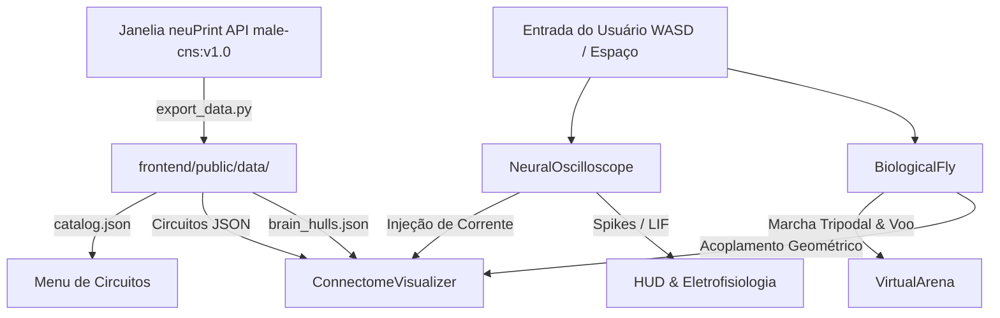

# GEMINI.md — Fonte Primária da Verdade Arquitetural: FlyBrain 3D

## 1. Visão Geral do Projeto
O **FlyBrain 3D** é uma aplicação interativa que une **neurociência computacional, conectoma biológico real e simulação biomecânica 3D** da mosca-das-frutas (*Drosophila melanogaster*). 

A plataforma extrai morfologia e dados sinápticos reais da base **neuPrint / Janelia Research Campus** (`male-cns:v1.0`), renderiza a anatomia e os circuitos no interior da cabeça da mosca em Three.js (WebGL) e simula a eletrofisiologia celular (LIF) em tempo real sincronizada com respostas motoras e biomecânicas.

---

## 2. Stack Tecnológica

### Backend & Neuroinformática
- **Linguagem**: Python 3.10+
- **Bibliotecas**:
  - `neuprint-python`: Cliente de comunicação com a API neuPrint (Janelia).
  - `navis`: Visualização e análise de morfologia de neurônios.
  - `flycns`: Extração e compilação de matrizes do cérebro completo.
  - `scipy` / `numpy`: Cálculo de Convex Hulls e transformações espaciais.
  - `python-dotenv`: Gerenciamento de credenciais e tokens de acesso.

### Frontend & Renderização 3D
- **Framework de Bundling**: Vite
- **Biblioteca Gráfica**: Three.js (v0.186+)
- **Estilização**: Vanilla CSS com design responsivo, estética dark mode/cyber-bio e glassmorphism.
- **Áudio**: Web Audio API para síntese procedural de sons biológicos e sinápticos.
- **Eletrofisiologia**: Canvas 2D customizado para osciloscópio biofísico de alta taxa de quadros.

---

## 3. Arquitetura do Sistema

---

## 4. Governança e Auditoria
O repositório adota estritamente os padrões de governança:
- **Backlog Oficial Único**: Localizado em [docs/todo.md](file:///c:/Users/Rubens/Desktop/projetinhos/Mosca/docs/todo.md).
- **Índice de Documentação**: Localizado em [docs/README.md](file:///c:/Users/Rubens/Desktop/projetinhos/Mosca/docs/README.md).
- **Regras Locais**: Localizadas no diretório `.agents/rules/`.
- **Commits**: Seguirão a especificação Conventional Commits (apenas quando solicitados pelo usuário).
